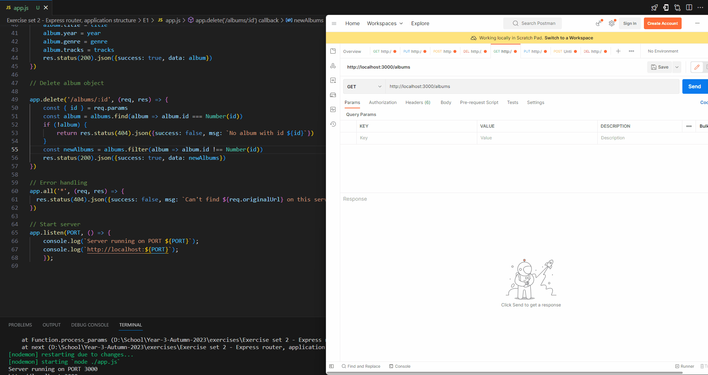
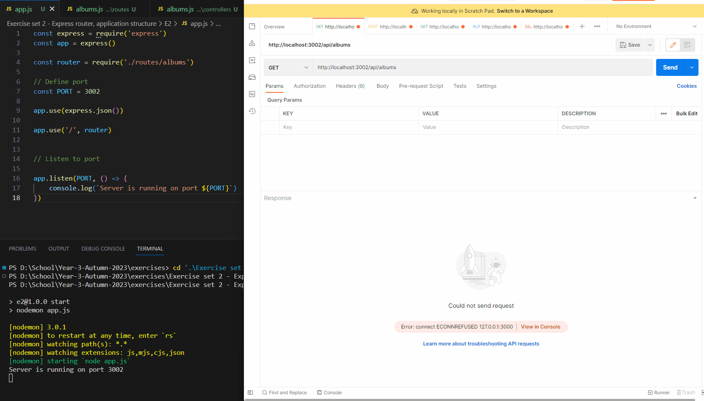
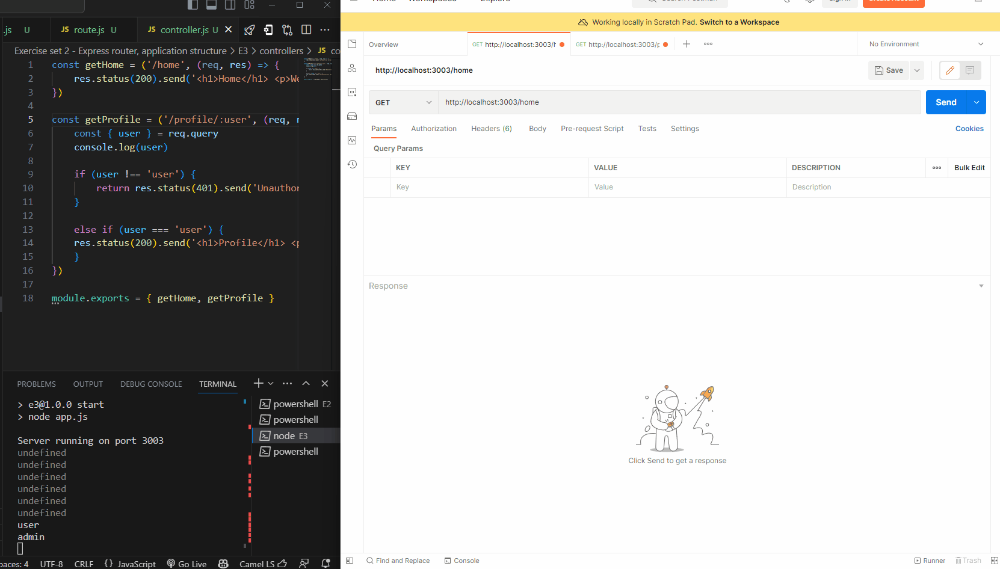
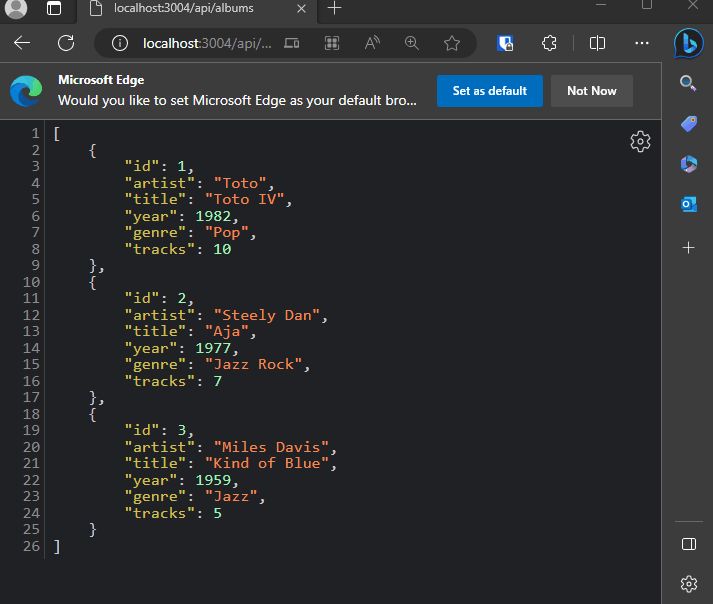

## Exercise showcase:

### Exercise set 2 - Express router, application structure
---

### Exercise 1  

#### 1. Create a basic album collection app (with similar functionality as the json-server used in the last exercises). You'll need to create the album collection app with Express framework based on the examples provided in the course material and in the lectures. The app needs to have basic CRUD functionality, but doesn't yet need to persist the changes. [4p]



[View code here](./E1/)

```js
const express = require('express')
const { albums } = require('./data')
const app = express()

// Define port
const PORT = 3001

app.use(express.json())

app.get('/', (req, res) => {
    res.send('<h1>API front</h1><a href="/api/albums/">albumbs</a>')
})

// Get request

app.get('/api/albums', (req, res) => {
    const newAlbums = albums.map(album => {
        const { id, artist, title, year, genre, tracks } = album
        return { id, artist, title, year, genre, tracks }
    })
    res.json(newAlbums)
})

app.get('/api/albums/:albumId', (req, res) => {
    const { albumId } = req.params

    const singleAlbum = albums.find(album => album.id === Number(albumId))
    
    if (!singleAlbum) {
        return res.status(404).json({success: false, msg: `No album with id ${albumId}`})
    }
    res.json(singleAlbum)
})

app.get('/api/query', (req, res) => {
    console.log(req.query)
    const {search, limit} = req.query
    let sortedAlbums = [...albums]

    if (search) {
        sortedAlbums = sortedAlbums.filter(album => {
            return album.artist.startsWith(search)
        })
    }
    if (limit) {
        sortedAlbums = sortedAlbums.slice(0, Number(limit))
    }
    if (sortedAlbums.length < 1) {
        return res.status(200).json({success: true, data: []})
    }
    res.status(200).json(sortedAlbums)
})

// Update requests

app.put('/api/albums/:id', (req, res) => {
    const { id } = req.params
    const { artist, title, year, genre, tracks } = req.body
    
    const album = albums.find(album => album.id === Number(id))

    if (!album) {
        return res.status(404).json({success: false, msg: `No album with id ${id}`})
    }

    const newAlbum = albums.map(album => {
        if (album.id === Number(id)) {
            album.artist = artist
            album.title = title
            album.year = year
            album.genre = genre
            album.tracks = tracks
        }
        return album
    })
    res.status(200).json({success: true, data: newAlbum})
})

// Delete method

app.delete('/api/albums/:id', (req, res) => {
    const { id } = req.params
    const album = albums.find(album => album.id === Number(id))

    if (!album) {
        return res.status(404).json({success: false, msg: `No album with id ${id}`})
    }

    const newAlbums = albums.filter(album => album.id !== Number(id))
    res.status(200).json({success: true, data: newAlbums})
})

// Post method

app.post('/api/albums', (req, res) => {
    console.log(req.body)
    const { artist, title, year, genre, tracks } = req.body
    if (!artist || !title || !year || !genre || !tracks) {
        return res.status(400).json({success: false, msg: 'Please provide all required fields'})
    }
    const newAlbum = { id: albums.length + 1, artist, title, year, genre, tracks }
    albums.push(newAlbum)
    res.status(201).json({success: true, data: newAlbum})
})

// Listen to port

app.listen(PORT, () => {
    console.log(`Server is running on port ${PORT}`)
})
```

---

### Exercise 2  

#### 2. Refactor the album collection app to use Express router setup with the file and directory structure described in the examples. Proceed in small steps and commit the code in stable situations, so you can revert back to a working situation if the changes break some functionality. [4p]



[View code here](./E2/)

`App.js`:  

```js
const express = require('express')
const app = express()

const router = require('./routes/albums')

// Define port
const PORT = 3002

// Middleware
app.use(express.json())

// All route handling is done in routes/albums.js
app.use('/', router)

// Listen to port

app.listen(PORT, () => {
    console.log(`Server is running on port ${PORT}`)
})
```

`routes.js`:  

```js
const express = require('express')
const router = express.Router()

// Import controllers
const {
    getAlbums,
    getAlbumById,
    getAlbumQuery,
    createAlbum,
    updateAlbum,
    deleteAlbum,
} = require('../controllers/albums')

// Define routes
router.get('/api/albums', getAlbums)
router.get('/api/albums/:albumId', getAlbumById),
router.get('/api/query', getAlbumQuery)
router.post('/api/albums', createAlbum)
router.put('/api/albums/:id', updateAlbum)
router.delete('/api/albums/:id', deleteAlbum)

module.exports = router
```

`controller.js`:  

```js
// Import data
const { albums} = require('../db/data')

// Get methods
const getAlbums =('/api/albums', (req, res) => {
    const newAlbums = albums.map(album => {
        const { id, artist, title, year, genre, tracks } = album
        return { id, artist, title, year, genre, tracks }
    })
    res.json(newAlbums)
})

const getAlbumById = ('/api/albums/:albumId', (req, res) => {
    const { albumId } = req.params

    const singleAlbum = albums.find(album => album.id === Number(albumId))
    
    if (!singleAlbum) {
        return res.status(404).json({success: false, msg: `No album with id ${albumId}`})
    }
    res.json(singleAlbum)
})

const getAlbumQuery = ('/api/query', (req, res) => {
    console.log(req.query)
    const {search, limit} = req.query
    let sortedAlbums = [...albums]

    if (search) {
        sortedAlbums = sortedAlbums.filter(album => {
            return album.artist.startsWith(search)
        })
    }
    if (limit) {
        sortedAlbums = sortedAlbums.slice(0, Number(limit))
    }
    if (sortedAlbums.length < 1) {
        return res.status(200).json({success: true, data: []})
    }
    res.status(200).json(sortedAlbums)
})

// Update method

const updateAlbum = ('/api/albums/:id', (req, res) => {
    const { id } = req.params
    const { artist, title, year, genre, tracks } = req.body
    
    const album = albums.find(album => album.id === Number(id))

    if (!album) {
        return res.status(404).json({success: false, msg: `No album with id ${id}`})
    }

    const newAlbum = albums.map(album => {
        if (album.id === Number(id)) {
            album.artist = artist
            album.title = title
            album.year = year
            album.genre = genre
            album.tracks = tracks
        }
        return album
    })
    res.status(200).json({success: true, data: newAlbum})
})

// Delete method

const deleteAlbum = ('/api/albums/:id', (req, res) => {
    const { id } = req.params
    const album = albums.find(album => album.id === Number(id))

    if (!album) {
        return res.status(404).json({success: false, msg: `No album with id ${id}`})
    }

    const newAlbums = albums.filter(album => album.id !== Number(id))
    res.status(200).json({success: true, data: newAlbums})
})

// Post method

const createAlbum = ('/api/albums', (req, res) => {
    console.log(req.body)
    const { artist, title, year, genre, tracks } = req.body
    if (!artist || !title || !year || !genre || !tracks) {
        return res.status(400).json({success: false, msg: 'Please provide all required fields'})
    }
    const newAlbum = { id: albums.length + 1, artist, title, year, genre, tracks }
    albums.push(newAlbum)
    res.status(201).json({success: true, data: newAlbum})
})

module.exports = { getAlbums, getAlbumById, getAlbumQuery, createAlbum, updateAlbum, deleteAlbum }
```

---

### Exercise 3  

#### 3. Create a simplified authentication middleware targeting a specific route in your application, that searches for a query string (user). If the query string is not provided, then send back a response as "Unauthorized". [3p]



[View code here](./E3/)


`app.js`:  

```js
const express = require('express');
const app = express();

app.use(express.json());

// Import routes
const router = require('./routes/route');

app.use('/', router);

const PORT = 3003;

app.listen(PORT, () => {
    console.log(`Server running on port ${PORT}`);
});
```

`route.js`:  

```js
const express = require('express');

const router = express.Router();

// Import controllers
const { getHome, getProfile } = require('../controllers/controller');

// Define routes
router.get('/home', getHome);
router.get('/profile/:user', getProfile);


module.exports = router;
```

`controller.js`:

```js
const getHome = ('/home', (req, res) => {
    res.status(200).send('<h1>Home</h1> <p>Welcome to my home page</p>')
})

const getProfile = ('/profile/:user', (req, res) => {
    const { user } = req.query
    console.log(user)
    
    if (user !== 'user') {
        return res.status(401).send('Unauthorized')
    }
    
    else if (user === 'user') {
    res.status(200).send('<h1>Profile</h1> <p>Welcome to my profile page</p>')
    }
})

module.exports = { getHome, getProfile }
```

---

### Exercise 4  

#### 4. Implement an index.html file that is served from the directory ./public with express.static(). On page load (http://localhost:port) your app should list all the albums from the current album collection by querying them from the API. It's enough to just list one or a few properties for each album. Below is a script that you can use for the functionality. [4p]



[View code here](./E4/)

1. Created folder `public` in the root of the app.
2. Created `index.js` file:

```html
<!DOCTYPE html>
 <html lang="en">
    <head>
        <meta charset="UTF-8">
        <meta name="viewport" content="width=device-width, initial-scale=1.0">
        <title>Document</title>
        <script src="https://cdnjs.cloudflare.com/ajax/libs/axios/0.27.2/axios.min.js" integrity="sha512-odNmoc1XJy5x1TMVMdC7EMs3IVdItLPlCeL5vSUPN2llYKMJ2eByTTAIiiuqLg+GdNr9hF6z81p27DArRFKT7A==" crossorigin="anonymous" referrerpolicy="no-referrer"></script>
        
    </head>
    <body>
        <div id="result">
            
        </div>

        <div style="margin-top: 10px;" id="result"></div>
        <script type="text/javascript" src="script.js"></script>
    </body>
 </html>
```
3. Created `script.js` file:

```js
const result = document.getElementById('result')
const baseUrl = `${window.location.origin}`

const fetchAlbums = async () => {
  try {
    const { data } = await axios.get(`${baseUrl}/api/albums`)
    console.log(data)
    console.log(`${baseUrl}/api/albums`)

    const albumsData = data.map((album) => {
      return `
      <div style="border: 1px solid black; border-radius: 1em; margin-bottom: 10px; width:50%">
      <ul>
        <li>Id: ${album.id}</li>
        <li>Artist: ${album.artist}</li>
        <li>Title: ${album.title}</li>
        <li>Year: ${album.year}</li>
        <li>Genre: ${album.genre}</li>
        <li>Tracks: ${album.tracks}</li>
      </ul>
      </div>
      `;
    })
    result.innerHTML = albumsData.join('')
  } catch (error) {
    console.log(error)
    result.innerHTML = '<div class="alert alert-danger">Could not fetch data</div>';
  }
}

fetchAlbums();
```
4. Updated `app.js`: to serve static files. 

```js
app.use(express.static('./public'))`
```
5. Updated `route.js`: 
    * Added import statement from controller: `showAlbum`
    * Added new route for `/`:  
        * `router.get('/', showAlbums)`

6. Updated `controller.js` to serve index.html file:  
```js 
const showAlbums = ('/', (req, res) => {
    res.sendFile(path.resolve(__dirname, './public/index.html'))
})
```

---


