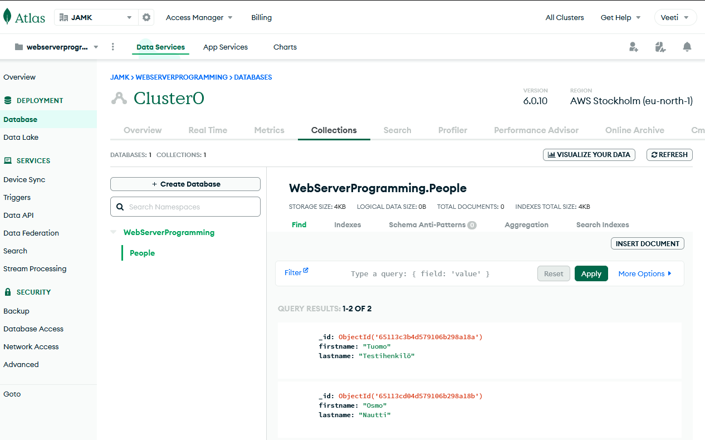
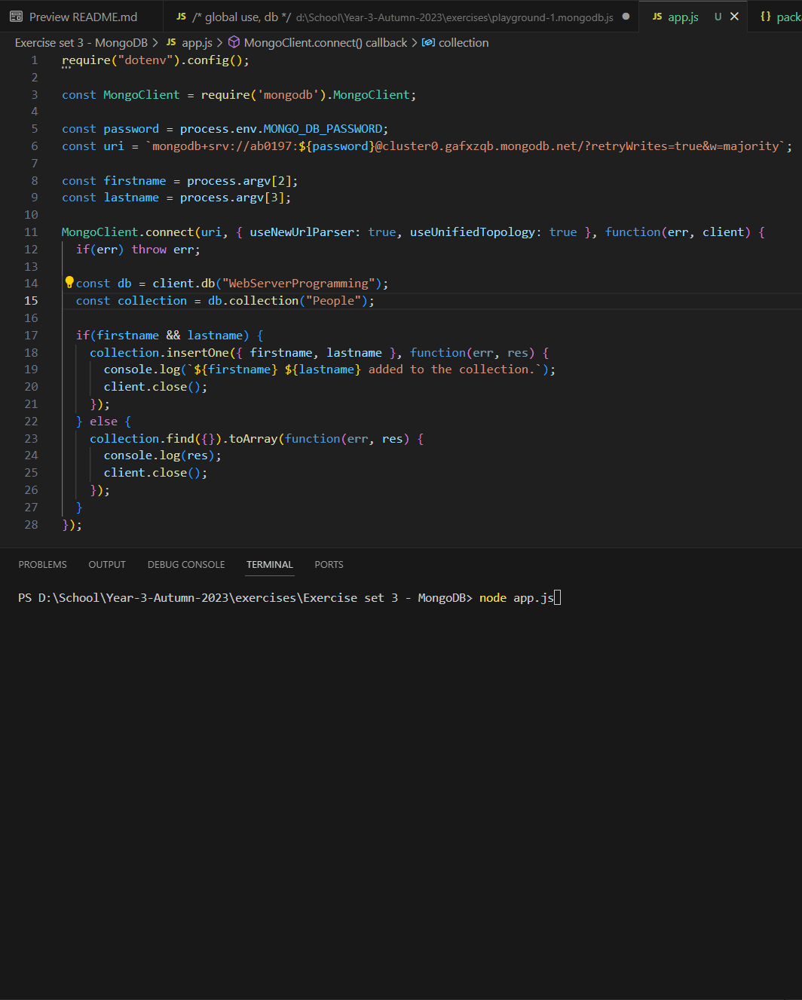
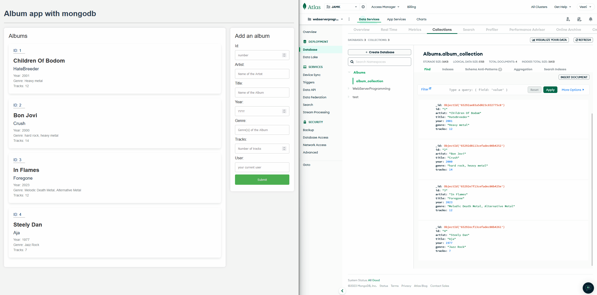

## Exercise showcase:

### Exercise set 3 - Express router, application structure
---

### Exercise 1

#### Create a free cluster to MongoDB Atlas following the instructions in the material. [1p] 

#### Create a new database (Database Deployments -> Browse collections -> Create database). Create a simple collection of names (firstname, lastname) in MongoDB Atlas. You can also add a few documents in Atlas. [2p]

  

---

### Exercise 3

#### Create a Node.JS CLI (no Express needed) application that can be used to add names to the collection. A CLI application is operated only from the command line. The names are inputted as command line arguments that can be accessed with . To run the program you would type `node mongodb_names.js Firstname Lastname`. If no arguments are specified, the existing list of names is returned. [4p]

---

### Exercise 4

#### Refactor the album collection app implemented in the previous exercises to use basic CRUD functionality provided by Mongoose. You'll need to create a model and establish the database connection. Examples for returning all resources and creating a resource using Mongoose in the route controllers are described in the material. You can use those as reference and study the Mongoose documentation to find the suitable methods for other CRUD operations. [7p]

---