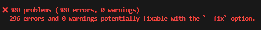
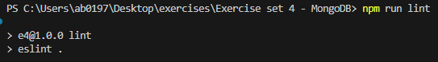
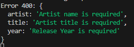
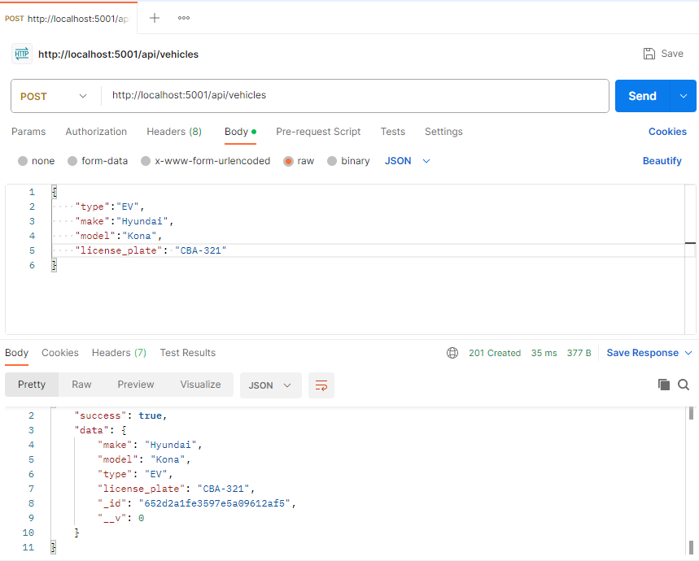
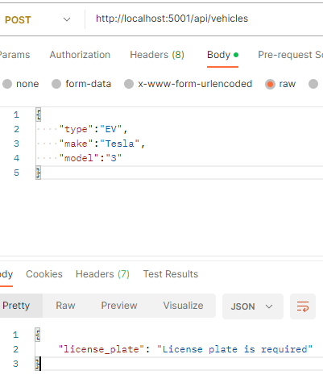
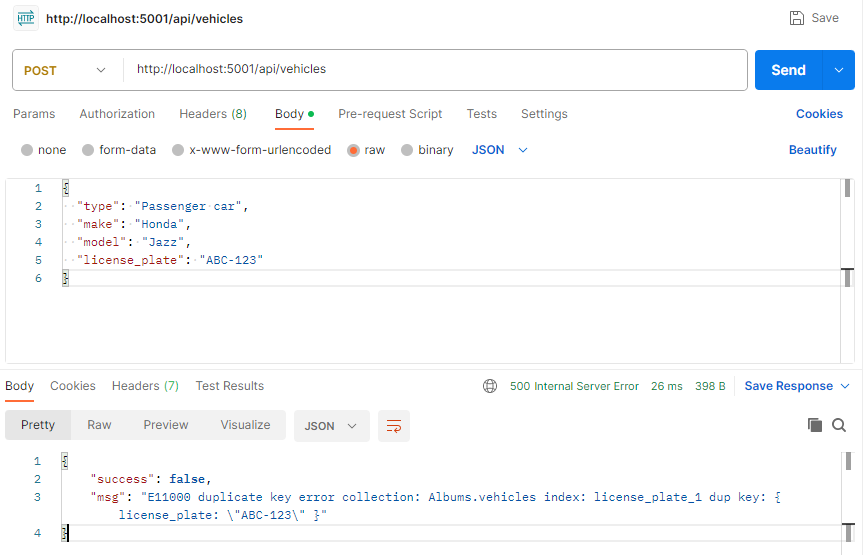
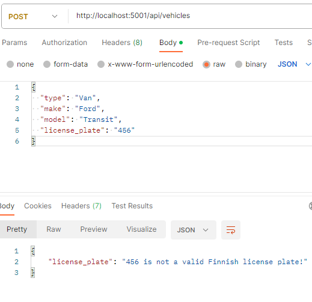

## Exercise showcase:

### Exercise set 3 - MongoDB
---

### Exercise 1

#### Install ESLint and configure it for the album collection project. Run ESLint in your project and correct any errors that the linter suggests. [3p]

1. Install Eslint to project as dev dependecy: `npm install eslint --save-dev`.
2. Initialize configuration: `npx eslint --init` make configuration selections in terminal.

**Run eslint manually:**  

1. Add lint script in `package.json`:

    ```js 
    "scripts": {
        "lint": "eslint .",
        "start": "nodemon app.js"
    },
    ```  

2. Run lint and see possible erros with command:  

    ```sh
    npm run lint
    ```

    

**Fixing the eslint errors:**

1. `296` erros were coming from indentantions not matching the eslint configuration. These errors are simply fixed by: 

    ```sh
    npm run lint -- --fix
    ```
2. Remaining 4 errors had to be fixed manually. Starting from: `'process' is not defined  no-undef`. Because `Enviroment variable` is handeled trough `dotenv`-npm package and `process-env` is not globally imported in the beginning of the file, it was required to `"node": "true"` in addition to eslint config file. This modification tells ESLint that your code is expected to run both in browsers and in a Node.js environment, which will recognize the process object as valid.

    ```js
    "env": {
            "browser": true,
            "commonjs": true,
            "es2021": true,
            "node": true, // <-- This line was added 
        },
    ```

3. Last `2` errors were caused by the `script.js` file where I used `axios`. I couldn't import the `axios`-npm package with `const axios = require("axios")` because `require` doesn't exist in browser environment. `Axios` importing was handled in the html file with:

    ```js
    <script 
            src="https://cdnjs.cloudflare.com/ajax/libs/axios/0.27.2/axios.min.js"
            integrity="sha512-odNmoc1XJy5x1TMVMdC7EMs3IVdItLPlCeL5vSUPN2llYKMJ2eByTTAIiiuqLg+GdNr9hF6z81p27DArRFKT7A=="
            crossorigin="anonymous" 
            referrerpolicy="no-referrer"
            >
    </script>
    ```
4. Fix for this error was again manually modifying the eslint config file with adding `axios` to `globals`:

    ```js
    "globals": {
            "axios": "readonly"
        }
    ```
5. Verifying that errors are cleared: `npm run lint`:  
    
      

---

### Exercise 2

#### Add validation for the fields in the album collection schema. Artist name, album title are required, track count must be > 0, Release year also required and within reasonable limits (e.g. 1900 - current year). [4p]

**Schema Changes:**

`Old mongoose schema:`  

```js
    const mongoose = require("mongoose");

    const RecordSchema = mongoose.Schema(
        {
            id: String,
            artist: String,
            title: String,
            year: Number,
            genre: String,
            tracks: Number

        },
        {
            versionKey: false,
        }
    );

    const Record = mongoose.model("Albums", RecordSchema, "album_collection");

    module.exports = {
        Record,
    };
```  
1. Artist's name, album title, release year and track count are now mandatory.
2. Release year has range defined from 1900 - Current year. (Current year is coming from javascript library with: `newDate().getFullYear`).
3. Track count value is set to be greater than 0.

`New mongoose schema:`

```js
const mongoose = require("mongoose");

const currentYear = new Date().getFullYear(); // <-- Get actual current year instead of hardcoding the year.

const RecordSchema = mongoose.Schema(
	{
		id: String,
        // Set to required with validation message.
		artist: { type: String, required: [true, "Artist name is required"]}, 
		title: { type: String, required: [true, "Artist title is required"]},
        // Set to required and also min & max values with validation message.
		year: {
			type: Number,
			required: [true, "Release Year is required"],
			min: [1900, "year must be atleast 1900"],
			max: [currentYear, `Year cannot be later than ${currentYear}`]},
		genre: String,
        // Set to required and min value with validation message.
		tracks: { type: Number,
			required: [true, "Track count is required and must be atleast 1"],
			min: [1, "Track count is required and must be atleast 1"]}

	},
	{
		versionKey: false,
	}
);

const Record = mongoose.model("Albums", RecordSchema, "album_collection");

module.exports = {
	Record,
};
```

4. In addition I changed the `getRecords()` controller to `console.log()` error message from schema validation.

```js
const createRecord = async (req, res) => {
	try {
		const record = await Record.create(req.body);
		res.status(201).json({ success: true, msg: record });
	} catch (error) {
		//res.status(500).json({ success: false, msg: error }); <- Previous error handling.
		const validationErrors = {};

		for (let field in error.errors) {
			validationErrors[field] = error.errors[field].message;
		}
		res.status(400).send(validationErrors);
		console.log("Error 400:",validationErrors); 
	}
};
```




---

### Exercise 3

#### Add license plate data to the vehicle app (in the examples folder) and construct a custom validator for the license plates (we can stick to standard Finnish pattern: 3 letters - 3 numbers). [4p]

**`Vehicle.js` schema:**

```js
const mongoose = require('mongoose')

const vehicleSchema = new mongoose.Schema({
  make: {
    type: String,
    required: true,
    maxLength: 10,
  },
  model: String,
  type: {
    type: String,
    required: true
  },
  license_plate: {
    type: String,
    // Custom validator added.
    validate: {
      validator: function(v) {
        return /^[A-Z]{3}-\d{3}$/.test(v) // Using regex expressions.
      },
      message: props => `${props.value} is not a valid Finnish license plate!` // Failed validation message
    },
    required: [true, 'License plate is required'], // Message for empty imput
    unique: true // No duplicate entries to database with unique key.
  }
})

module.exports = mongoose.model('Vehicle', vehicleSchema)
```

**Testing custom validator in `POSTMAN`:**

1. Create (with license plate, should pass the validation)

    `POST http://{{host}}/api/vehicles/`
```json

Content-Type: application/json

{
    "type":"EV",
    "make":"Hyundai",
    "model":"Kona",
    "license_plate": "CBA-321"
}
```


2. Create (no license plate, should fail the validation)

    `POST http://{{host}}/api/vehicles/`
```json

Content-Type: application/json

{
    "type":"EV",
    "make":"Tesla",
    "model":"3"
}
```


3. Create (should fail the validation, duplicate license plate!) ABC-123 exists in database.

    `POST http://{{host}}/api/vehicles/`
```json

Content-Type: application/json

{
  "type": "Passenger car",
  "make": "Honda",
  "model": "Jazz",
  "license_plate": "ABC-123"
}
```


4. Create (Should fail the validation, invalid license plate)

    `POST http://{{host}}/api/vehicles/`
```json

Content-Type: application/json

{
  "type": "Van",
  "make": "Ford",
  "model": "Transit",
  "license_plate": "456"
}
```

---