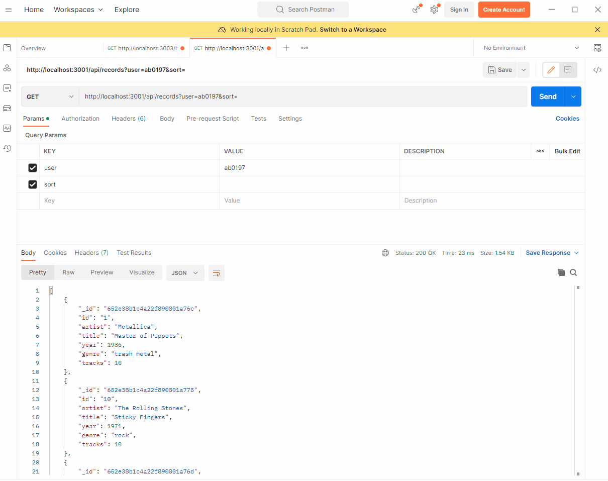
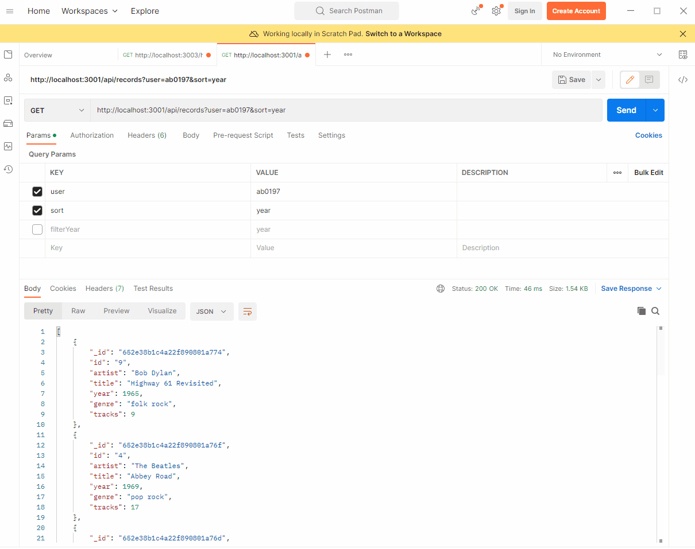
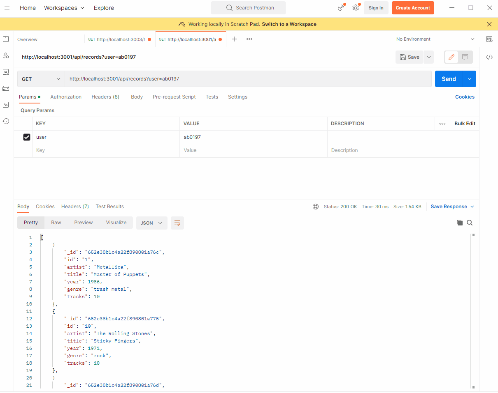
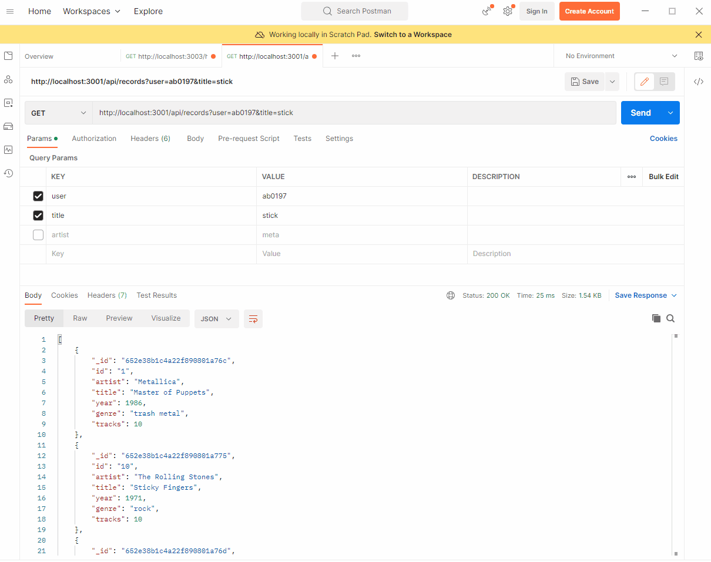
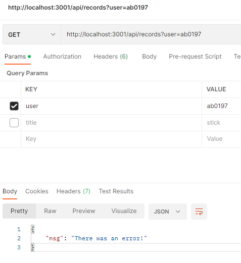

## Exercise showcase:

### Exercise set 5 - API design
---

### Exercise 1

#### Implement a sorting feature to the API that can be used to sort the returned albums by different fields (artist, release year, etc). [2p]

The ``getRecords()`` function has been modified to include a new functionality that sorts the records based on a query parameter called sort.

** Example query:**

>`http://localhost:3001/api/records?user=ab0197&sort=year`

The original ``getRecords()`` function simply retrieved all the records from the database and returned them as a JSON response.

```js
const getRecords = async (req, res) => {
	try {
		const records = await Record.find({});
		return res.status(200).json(records);
	} catch (error) {
		res.status(500).json({ success: false, msg: error });
	}
};

```

The new ``getRecords()`` function first checks if the sort parameter is present in the request query. If it is, the function sorts the records based on the value of the sort parameter. The sort parameter is a comma-separated list of fields to sort by. If the sort parameter is not present, the function sorts the records by the `id` field.

```js
const getRecords = async (req, res) => {
		const { sort } = req.query; // checks if the sort parameter is present in the request query
		let result = Record.find({});
		try {
			if (sort) {
				const sortList = sort.split(",").join(" "); // comma-separated list of fields to sort by
				result = result.sort(sortList);
			} else {
				result = result.sort("id"); // If the sort parameter is not present, sorting is done by Id.
			}

			const records = await result;
			return res.status(200).json(records);
		} catch (error) {
			res.status(500).json({ success: false, msg: error });
		}
	};
```

The modified ``getRecords()`` function then returns the sorted records as a JSON response with a status code of 200. If there is an error during the sorting or retrieval process, the function returns a JSON response with a status code of 500 and an error message.



----

### Exercise 2

#### Add a feature to filter the albums by release year. [2p]

`getRecords()` function now includes a new functionality to filter the records based on a query parameter called ``filterYear``.

**Example query:** 

> `http://localhost:3001/api/records?user=ab0197&filterYear=year=1971`

The ``filterYear`` parameter is used to filter the records by release year. If the `filterYear` parameter is present in the request query, a queryObject is constructed to filter the records according to the specified criteria.

```js
const { sort, filterYear } = req.query;
		const queryObject = {};
```

The ``filterYear`` parameter accepts a comma-separated list of filters.  Each filter follows the pattern: field-operator-value. In this context, the field is the attribute to filter by (specifically, "year"). The operator can be one of the following: (`<`, `>`, `<=`, `>=`, or `=`). The value is the numeric year to compare against.

```js
const operatorMap = {
				"<": "$lt",
				">": "$gt",
				"<=": "$lte",
				">=": "$gte",
				"=": "$eq",
		};
		const regEx = /\b(<|>|<=|>=|=)\b/g;
```
The function employs a regular expression to transform the ``filterYear`` parameter into a format that's easier to process. It then breaks down the ``filterYear`` parameter into individual filters using the comma as a delimiter. For each filter, the function checks if the field is valid (in this case, "year") and then updates the ``queryObject`` accordingly.

```js
const options = ["year"];

		filters.split(",").forEach((item) => {
			const [field, operator, value] = item.split("-");
			if (options.includes(field)) {
				queryObject[field] = { [operator]: Number(value)};
			}
		});
```


---

### Exercise 3

#### Add a `fields` filter where the server responses with only the fields that the client requested. You can use `Query.prototype.select()` found in Mongoose. [3p] 

New query parameter `fields` is added. 

**Example query:**  

> `http://localhost:3001/api/records?user=ab0197&fields=tracks,artist`

```js
const getRecords = async (req, res) => {
		const { sort, filterYear, fields } = req.query;
		const queryObject = {};
```

Old `try-catch` block is updated and `fields` parameter is included. `Fields` is a comma-seperated list. Query parameter is checked if `fields` is existing and only fields defined in the parameter are returned.

```js
try {
			let result = Record.find(queryObject);

			if (fields) {
				result.select(fields.split(","));
			}
```



---

### Exercise 4

#### Add a search functionality for artist names and album titles using ``regex``, so that album titles and artist names can be filtered with partial patterns found in those fields (e.g. search pattern ``tot`` matches the artist name ``Toto``). Use the same controller as for the previous filters (utilize query strings). [4p]

New query parameter `title` & ``artist`` is added. 

**Example query:**  

> `http://localhost:3001/api/records?user=ab0197&artist=meta`

```js
const getRecords = async (req, res) => {
		const { sort, filterYear, fields, title, artist } = req.query;
		const queryObject = {};
```

The `if (title)` statement checks if the `title` parameter is present in the query string. If it is, a new filter object is added to the `queryObject` object that uses the `$regex` operator to filter the `title` field. In this case, the `$regex` operator is used to perform a case-insensitive search for the `title` parameter in the `title` field.

The `$options: "i"` part of the filter object specifies that the regular expression should be case-insensitive. This means that the regular expression will match both uppercase and lowercase letters.

```js
if (title) {
			queryObject.title = { $regex: title, $options: "i" };
		}
		if (artist) {
			queryObject.artist = { $regex: artist, $options: "i" };
		}
```



---

#### Exercise 5

#### Modify the error handling for the album collection app, so that the ``try...catch`` blocks can be removed from the controllers. The easier solution is to use ``express-async-errors`` instead of the async wrappers. Test that any asynchronous errors are still caught in your own error handling middleware. [3p]

Install first `express-async-errors` with command:

> `npm install express-async-errors`

#### ``recordsController.js:``

Remove all the `try...catch` blocks. As an example ``getRecord`` controller:

```js
const getRecord = async (req, res) => {
	const { id } = req.params;
	const singleRecord = await Record.findById(id);
	return res.status(200).json(singleRecord);
  };
```

Adding a asynchnronous error in the contoller:

```js
const getRecord = async (req, res) => {
	const { id } = req.params;
	const singleRecord = await Record.findById(id);
	//return res.status(200).json(singleRecord);
	throw new Error('This is an error');
  };
```
#### ``app.js:``

Import ``express-async-express`` in the ``app.js`` before any other imports:

> `require("express-async-errors");`

Add global error handling after routes: 

```js
app.use("/api", checkUsername);
app.use("/api/records", records);
app.use(express.static("public"));

// Global error handler after routes
app.use((err, req, res, next) => {
	console.log(err);
	return res.status(500).json({ msg: "There was an error!" });
});
```  

Testing out the error async errors in the ``getRecord()``:

`http://localhost:3001/api/records/?user=ab0197&id=1`



---


